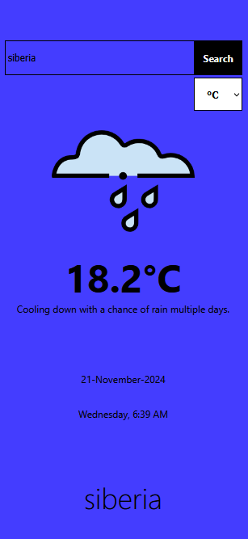
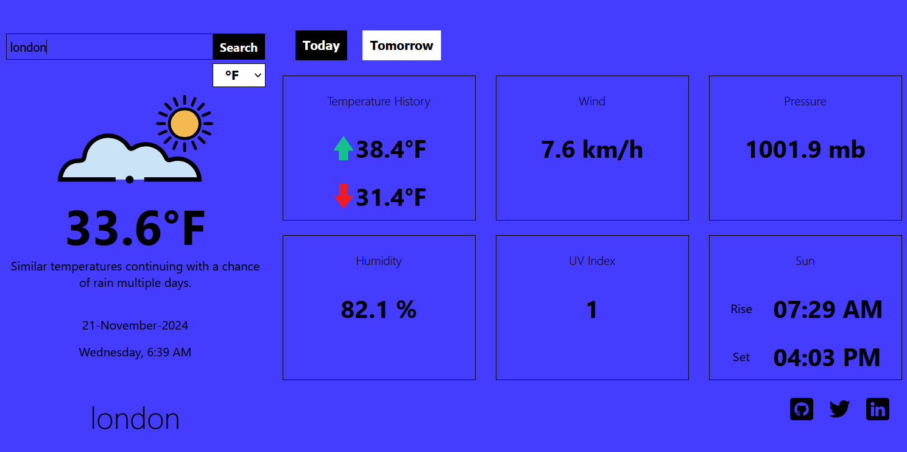

# Weather App

A responsive weather app that provides current weather conditions and forecasts for tomorrow. It uses the VisualCrossing API to fetch weather data, and allows users to view temperature in both Fahrenheit and Celsius, as well as other essential weather metrics.

## Features

- **Responsive Design**: Works seamlessly on both mobile and desktop devices.
- **Temperature Conversion**: Toggle between Fahrenheit and Celsius.
- **Weather Data**: Displays current temperature, humidity, pressure, wind speed, UV index, and more.
- **Forecast**: View today's and tomorrow's weather forecast.
- **Temperature History**: Get historical temperature data.
- **Sunrise & Sunset**: View the times for sunrise and sunset based on the location.

## Screenshots

### Mobile Version

### PC Versionf

